# CMS Screenshots

These screenshots come from a real Silverstripe CMS 6 installation running Elemental 6 and this module. They are cropped only to keep the relevant CMS interaction readable.

## Page and Element workflow

The page editor keeps the selected styling summary visible while the Element is collapsed:

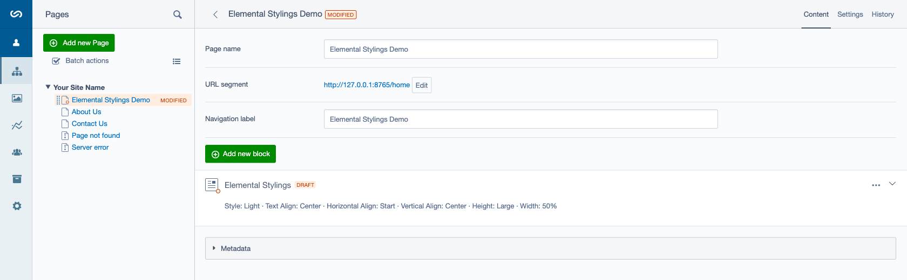

Element content can be edited beside the standard live preview:

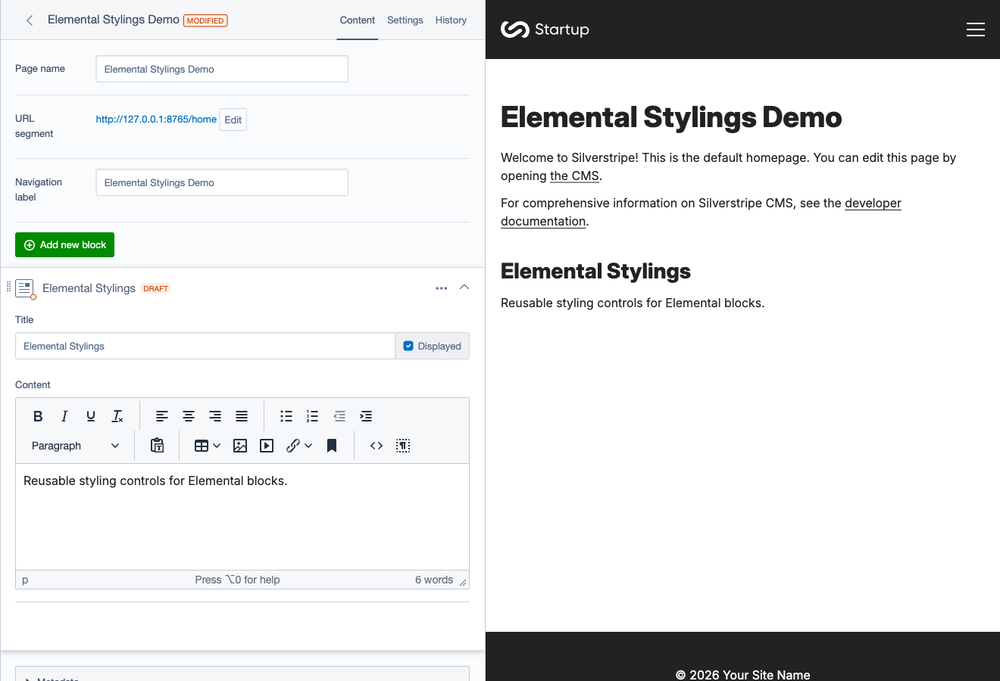

Styling is a dedicated Element action alongside Content and Settings:

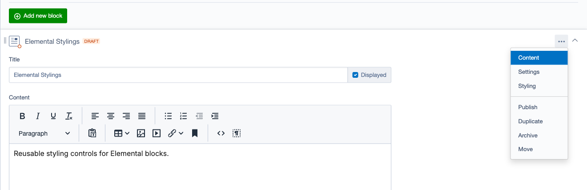

## Styling controls

Every enabled styling extension uses the same visual optionset behavior. This example enables all eight extensions and all 27 canonical options:

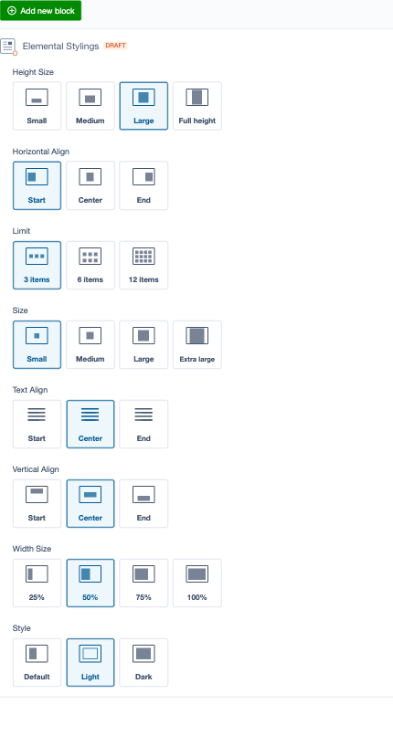

### Control details

| Height | Horizontal alignment |
|---|---|
| 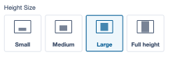 | 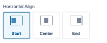 |

| Limit | Size |
|---|---|
| 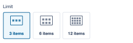 | 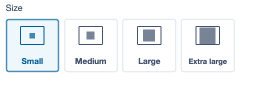 |

| Text alignment | Vertical alignment |
|---|---|
| 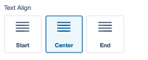 | 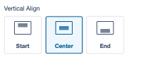 |

| Width | Style |
|---|---|
| 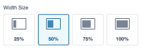 | 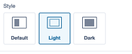 |

## Selected values

The collapsed Element summary lists the selected labels without exposing project CSS classes:

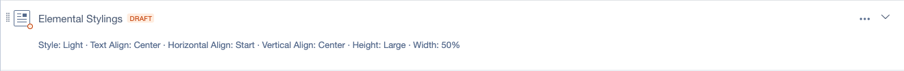
